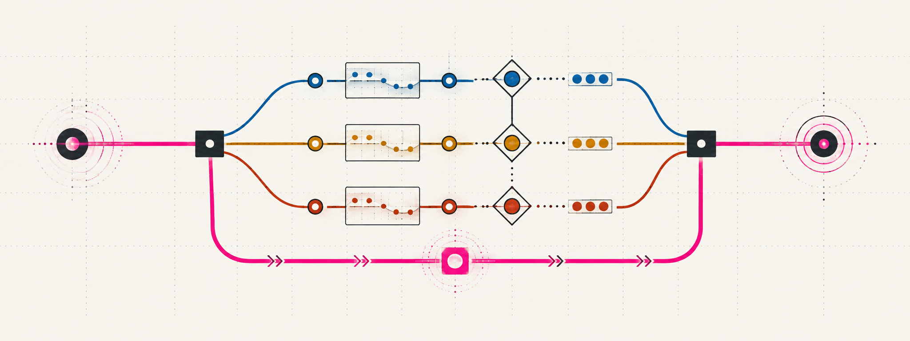

<p align="center">
  
</p>

<h1 align="center">Jev Router</h1>

<p align="center">
  A fail-open, advisory <a href="https://typesafe.ai/">Jev</a> workflow router for Codex and Claude Code.
</p>



> [!IMPORTANT]
> This is an independent community plugin. It is not an official TypeSafe AI, OpenAI, or Anthropic project.

Jev Router asks TypeSafe AI's Jev model for a small typed routing hint before each prompt. The hint helps Codex or Claude Code select a workflow and capability while leaving AgentKit rules, user authorization, permissions, deterministic checks, and review gates in control.

## What it returns

Each successful call adds four advisory fields to the prompt context:

| Field | Values |
| --- | --- |
| `workflow` | `direct`, `investigate`, `implement`, `plan`, or `review` |
| `domain` | The primary engineering capability, such as frontend, backend, testing, security, or Git |
| `risk_0_to_4` | A bounded operational-risk score |
| `execution` | `solo`, `independent_review`, or `parallelizable` |

Every field includes Jev's confidence. Low-confidence fields are marked uncertain and may be ignored.

## Fail-open behavior

Normal Codex or Claude Code routing continues without Jev context when:

- the API key is missing;
- the prompt looks credential-sensitive;
- the request times out or the network is unavailable;
- TypeSafe returns an HTTP error; or
- the response does not match the expected typed schema.

The router makes one request, retries zero times, and never uses Jev to lower risk or bypass a gate.

## Install

This repository is both a Codex marketplace and a Claude Code marketplace. Both hosts install the same plugin directory and run the same hook script.

### Codex

Add this repository as a Codex marketplace, then install the plugin:

```bash
codex plugin marketplace add sonson0910/jev-router
codex plugin add jev-router@jev-router
```

Start a new Codex thread and review the hook in `/hooks` before trusting it.

### Claude Code

Add this repository as a Claude Code marketplace, then install the plugin:

```bash
claude plugin marketplace add sonson0910/jev-router
claude plugin install jev-router@jev-router
```

Start a new Claude Code session so the `UserPromptSubmit` hook loads. Run `/hooks` to inspect it. The plugin adds its own hook group and leaves existing hooks in `settings.json` unchanged.

Requests sent from Claude Code are labeled `agentkit-jev-router/0.1.0 (claude-code)` in the `User-Agent` header. The label is detected from the `CLAUDECODE=1` environment variable that Claude Code sets, or it can be forced with `--client claude-code` when the script is registered manually.

## Configure the API key

Store the key in a private local file:

```bash
install -d -m 700 "$HOME/.config/typesafe"
read -rsp 'TypeSafe API key: ' jev_api_key; printf '\n'
umask 077
printf '%s' "$jev_api_key" > "$HOME/.config/typesafe/api-key"
unset jev_api_key
```

The plugin checks `TYPESAFE_API_KEY` first, then `~/.config/typesafe/api-key`. The file must be a regular non-symlink file, no larger than 4 KiB, with no group or other permissions.

## Configuration

| Variable | Default | Purpose |
| --- | --- | --- |
| `JEV_ROUTER_ENABLED` | `1` | Set to `0` to disable the router |
| `JEV_ROUTER_TIMEOUT_MS` | `1200` | Request timeout; accepted range is 250–5000 ms |
| `JEV_ROUTER_DEBUG` | `0` | Set to `1` to print skip and fallback reasons to stderr |
| `TYPESAFE_DEFAULT_MODEL` | `jev-latest` | Override the Jev model name |

Only the bounded user prompt is sent to TypeSafe. Repository files and the current working directory are not included.

## Development

Run the focused test suite:

```bash
node --test plugins/jev-router/hooks/jev-router.test.cjs
```

Validate the plugin structure before publishing changes. For Codex, use the `plugin-creator` validator. For Claude Code, run:

```bash
claude plugin validate .
claude plugin validate plugins/jev-router
```

The shared hook command resolves the plugin root through `${CLAUDE_PLUGIN_ROOT:-$PLUGIN_ROOT}`, so one `hooks/hooks.json` works in both hosts.

## License and attribution

The plugin code is available under the [MIT License](LICENSE).

The Jev Router logo and routing illustration are original project artwork. TypeSafe, Jev, their names, and their brand assets belong to their respective owner; references here identify the compatible service and do not imply endorsement.
